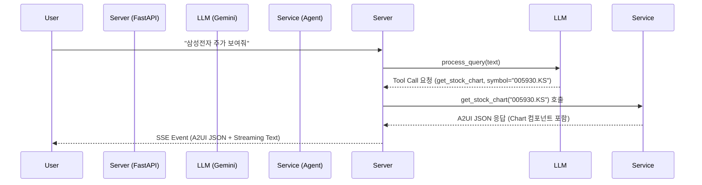

# A2UI (Agentic AI User Interface)

A2UI는 LLM(Large Language Model)의 Tool Calling 기능을 활용하여 동적으로 사용자 인터페이스(UI)를 생성하고 제어하는 Agentic UI 프레임워크입니다.
서버 중심(Server-Driven) UI 설계를 통해, AI가 사용자의 의도를 파악하고 적절한 도구를 호출한 뒤, 그 결과를 사전에 정의된 UI 컴포넌트로 렌더링하여 클라이언트에게 전달합니다.

## 🚀 주요 기능

- **LLM Tool Calling 기반 UI 생성**: 사용자의 자연어 요청을 해석하여 적절한 함수(Tool)를 실행하고, 그 결과에 맞는 UI를 동적으로 생성합니다.
- **Server-Driven UI (SDUI)**: 서버에서 JSON 형태로 UI 구조를 정의하여 클라이언트로 전송합니다. 클라이언트는 이를 렌더링만 담당합니다.
- **멀티 인텐트(Multi-Intent) 지원**: "애플 주가랑 강남역 맛집 알려줘"와 같은 복합 요청을 한 번에 처리하고, 여러 UI 블록을 동시에 렌더링할 수 있습니다.
- **스트리밍 코멘터리**: 데이터 시각화(차트 등)와 함께 AI의 분석 내용을 실시간 스트리밍으로 제공합니다.

---

## 🛠️ 설치 및 실행

### 1. 환경 설정

`uv` 또는 `pip`를 사용하여 의존성을 설치합니다.

```bash
# 가상환경 생성 및 활성화
python -m venv .venv
source .venv/bin/activate  # Mac/Linux

# 의존성 설치
pip install -r requirements.txt
```

### 2. 환경 변수 설정

`.env` 파일을 생성하고 필요한 API Key를 입력합니다.

```env
GOOGLE_API_KEY=your_gemini_api_key
NAVER_CLIENT_ID=your_naver_client_id  # 맛집/쇼핑 검색용
NAVER_CLIENT_SECRET=your_naver_client_secret
```

### 3. 서버 실행

```bash
uvicorn app.api.main:app --reload
```

---

## 🧩 Tool Calling 기반 호출 프로세스 (상세 설명)

A2UI의 핵심은 **"LLM의 판단 -> 도구 실행 -> UI 렌더링"** 으로 이어지는 파이프라인입니다.

### 1. 프로세스 개요



### 2. 코드 레벨 상세 설명

#### Step 1: 도구(Tool) 정의 (`app/services/llm_wrapper.py`)

LLM에게 사용 가능한 도구들을 JSON Schema 형태로 알려줍니다.

```python
# llm_wrapper.py

auth_tool = {
    "function_declarations": [
        {
            "name": "get_stock_chart",
            "description": "Get the stock price history chart for a given symbol.",
            "parameters": {
                "type": "OBJECT",
                "properties": {
                    "symbol": {
                        "type": "STRING",
                        "description": "The stock symbol (e.g. AAPL, GOOG)."
                    }
                },
                "required": ["symbol"]
            }
        },
        # ... 다른 도구들 (find_restaurants, calculate_loan 등)
    ]
}

self.model = genai.GenerativeModel(
    model_name='gemini-2.0-flash',
    tools=[auth_tool],
    # ...
)
```

#### Step 2: LLM의 의도 파악 및 도구 호출 반환 (`app/services/llm_wrapper.py`)

사용자의 자연어 입력을 받아 LLM이 도구 호출이 필요한지 판단합니다.

```python
# llm_wrapper.py

def process_query(self, text: str) -> Dict[str, Any]:
    response = self.chat.send_message(text)
    
    # LLM 응답에서 function_call 파싱
    tool_calls = []
    if response.parts:
        for part in response.parts:
            if fn := part.function_call:
                tool_calls.append({
                    "tool_name": fn.name,
                    "tool_args": dict(fn.args)  # 예: {"symbol": "AAPL"}
                })
    
    if tool_calls:
        return {
            "type": "multiple_tool_calls",
            "calls": tool_calls
        }
    # ...
```

#### Step 3: 도구 실행 및 라우팅 (`app/api/main.py`)

서버는 LLM이 요청한 도구 이름(`tool_name`)을 확인하고, 실제 서비스 로직을 실행합니다.

```python
# main.py (chat_stream 함수 내부)

if processed["type"] == "multiple_tool_calls":
    for call in processed["calls"]:
        tool_name = call["tool_name"]
        args = call["tool_args"]
        
        if tool_name == "get_stock_chart":
            # 실제 서비스 호출
            res = stock_service.get_stock_chart(args.get("symbol"))
            
        elif tool_name == "find_restaurants":
            # 실제 서비스 호출
            res = restaurant_service.find_restaurants(args.get("location"), args.get("cuisine"))
            
        # ... 호출 결과(res)는 A2UIResponse 객체
```

#### Step 4: UI 생성 및 Jinja2 템플릿 렌더링 (`app/services/agent.py`)

서비스 로직은 데이터를 가져온 후, 미리 정의된 **Jinja2 템플릿**에 데이터를 주입하여 A2UI JSON을 생성합니다.

```python
# agent.py

def get_stock_chart(self, symbol: str) -> Union[A2UIResponse, TextResponse]:
    # 1. 데이터 조회 (yfinance 등)
    ticker = yf.Ticker(symbol)
    hist = ticker.history(period="1y")
    # ... 데이터 가공 ...

    # 2. 템플릿 렌더링 (UI 구조 생성)
    return self._render_template("stock_chart.json.j2", {
        "symbol": symbol.upper(),
        "prices": prices,
        "current_price": f"${hist['Close'].iloc[-1]:.2f}"
    })
```

**템플릿 예시 (`stock_chart.json.j2`)**:
```jinja2
{
  "surfaceUpdate": {
    "components": [
      {
        "id": "{{ uid }}_chart",
        "component": {
          "Chart": {
            "data": {{ prices | tojson }},
            "color": "#0F9D58"
          }
        }
      }
    ]
  }
}
```

#### Step 5: 클라이언트로 스트리밍 전송 (`app/api/main.py`)

생성된 A2UI 데이터는 SSE(Server-Sent Events)를 통해 클라이언트로 전송됩니다.

```python
# main.py

# A2UI 이벤트 전송
if res and isinstance(res, A2UIResponse):
    yield f"event: a2ui\ndata: {json.dumps(res.model_dump())}\n\n"

# (옵션) LLM 코멘터리 스트리밍 전송
async for chunk in llm.generate_commentary_stream(...):
    yield f"event: text\ndata: {json.dumps({'text': chunk})}\n\n"
```

## 📂 프로젝트 구조

```
a2ui/
├── app/
│   ├── api/
│   │   └── main.py          # FastAPI 서버 및 엔드포인트
│   ├── services/
│   │   ├── agent.py         # 실제 기능을 수행하는 서비스 로직 (Tools)
│   │   └── llm_wrapper.py   # Gemini LLM 연동 및 Function Calling 처리
│   ├── schemas/             # Pydantic 모델 정의
│   └── templates/           # UI 컴포넌트 템플릿 (Jinja2)
├── static/                  # 클라이언트 정적 파일 (HTML, JS Renderer)
├── A2UI_implementation.md   # 상세 구현 가이드
└── requirements.txt         # 프로젝트 의존성
```
